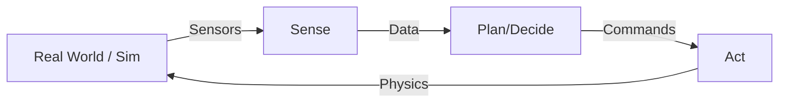

# Foundations of Physical AI & Embodied Intelligence

> "Intelligence isn't just about processing data; it's about acting upon the world."

## Learning Objectives

By the end of this chapter, you will be able to:
*   Define **Embodied Intelligence** and how it differs from pure software AI.
*   Explain the **Perception-Action Loop** architecture.
*   Write a basic **Agent-Environment** interaction loop in Python.
*   Launch a **Simulation** environment.
*   Deploy a conceptual model to simulated output.

## Core Theory: Embodiment

**Physical AI** refers to artificial intelligence systems that interact with the physical world through sensors and actuators. Unlike a chatbot that lives in a server, a Physical AI sits inside a robot body (an **embodiment**) and is subject to the laws of physics.

### KEY CONCEPT: The Perception-Action Loop

1.  **Sense**: The robot gathers data from the world (Images, LIDAR, IMU).
2.  **Perceive**: The "Brain" interprets this data (Object detection, State estimation).
3.  **Plan**: The system decides on a goal and how to reach it.
4.  **Act**: Commands are sent to motors/actuators to change the state of the world.

## System Architecture

The most fundamental architecture in robotics is the **Control Loop**.



In modern robotics, we implement this loop using **ROS 2 (Robot Operating System)**.

## Code Example: The Software Agent

Before we touch ROS 2, let's understand the math of embodiment with a pure Python example.

We will simulate a 1D robot moving towards a goal.

```python
import time
import random

class SimpleRobot:
    def __init__(self, name: str, start_pos: float = 0.0):
        self.name = name
        self.position = start_pos
        self.velocity = 0.0

    def sense(self) -> float:
        """Returns current position with simulated noise."""
        noise = random.uniform(-0.1, 0.1)
        return self.position + noise

    def act(self, command_velocity: float, dt: float = 0.1):
        """Updates physics state based on command."""
        self.velocity = command_velocity
        # Kinematic equation: x_new = x_old + v * t
        self.position += self.velocity * dt

class Controller:
    def __init__(self, target: float, kp: float = 1.0):
        self.target = target
        self.kp = kp  # Proportional Gain

    def decide(self, current_pos: float) -> float:
        """P-Controller: Error-based reaction."""
        error = self.target - current_pos
        # Output proportional to error
        cmd = self.kp * error
        return cmd

def run_simulation():
    robot = SimpleRobot("Bot-1")
    brain = Controller(target=10.0)

    print(f"Starting Simulation for {robot.name} targeting 10.0m")
    
    for step in range(20):
        # 1. Sense
        sensed_pos = robot.sense()
        
        # 2. Plan/Decide
        cmd_vel = brain.decide(sensed_pos)
        
        # 3. Act
        robot.act(cmd_vel)
        
        print(f"Step {step}: Pos={sensed_pos:.2f}m | Cmd={cmd_vel:.2f}m/s")
        time.sleep(0.1)

if __name__ == "__main__":
    run_simulation()
```

### Run It
Save this as `simple_agent.py` and run it on your Linux machine:

```bash
python3 simple_agent.py
```

You will see the robot "sense" its position and "act" to reduce the error to zero. This is the seed of all robotic control.

## Simulation Workflow

In this book, we don't just print text; we visualize. We will use **Gazebo** for standard physics and **Isaac Sim** for photorealism.

### Task: Install ROS 2 Humble (Minimal)

To prepare for the next chapters, ensure you have the basic ROS 2 setup.

```bash
# Ubuntu 22.04 LTS
locale  # check for UTF-8

sudo apt update && sudo apt install locales
sudo locale-gen en_US en_US.UTF-8
sudo update-locale LC_ALL=en_US.UTF-8 LANG=en_US.UTF-8
export LANG=en_US.UTF-8

sudo apt install software-properties-common
sudo add-apt-repository universe

sudo apt update && sudo apt install curl -y
sudo curl -sSL https://raw.githubusercontent.com/ros/rosdistro/master/ros.key -o /usr/share/keyrings/ros-archive-keyring.gpg

echo "deb [arch=$(dpkg --print-architecture) signed-by=/usr/share/keyrings/ros-archive-keyring.gpg] http://packages.ros.org/ros2/ubuntu $(. /etc/os-release && echo $UBUNTU_CODENAME) main" | sudo tee /etc/apt/sources.list.d/ros2.list > /dev/null

sudo apt update
sudo apt install ros-humble-desktop
```

## Hardware & Compute Notes

*   **Compute**: For the code above, any CPU works.
*   **Real World**: On a real robot, `robot.act()` would send CAN bus or PWM signals to motor drivers.
*   **Safety**: Real robots have mass and momentum. A bug in `decide()` can cause physical damage. Always test in **sim** first!

## Assessment

1.  Modify `simple_agent.py` to add a "Goal Threshold" (stop when within 0.1m).
2.  Install ROS 2 Humble on your machine (or VM).
3.  Verify installation with `ros2 doctor`.

---
**Next Module**: We dive into the Nervous System and create our first ROS 2 Nodes.
