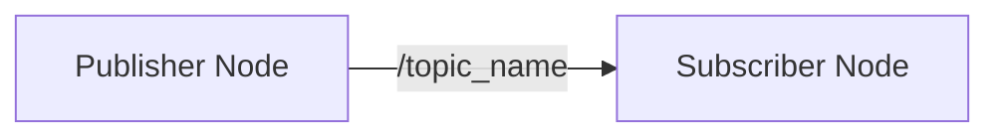

# The Nervous System: Nodes & Topics

> "A robot is a graph of communicating processes."

## Learning Objectives

By the end of this chapter, you will be able to:
*   Create a **ROS 2 Workspace**.
*   Write a Python **Publisher Node** to send data.
*   Write a Python **Subscriber Node** to receive data.
*   Launch multiple nodes to form a **Computational Graph**.

## Core Theory: The Graph

In ROS 2, your software is split into small, independent programs called **Nodes**. These nodes communicate over named channels called **Topics**.

*   **Node**: A executable process (e.g., Camera Driver, Path Planner).
*   **Topic**: A named bus for data exchange (e.g., `/camera/image_raw`).
*   **Message**: The data structure sent over a topic (e.g., `sensor_msgs/Image`).

## System Architecture



## Code Example: Hello ROS

We will create a simple "Talker/Listener" system.

### 1. Create Workspace

```bash
mkdir -p ~/ros2_ws/src
cd ~/ros2_ws/src
ros2 pkg create --build-type ament_python my_first_package
```

### 2. Publisher Node (`simple_publisher.py`)

Place this in `~/ros2_ws/src/my_first_package/my_first_package/simple_publisher.py`.

```python
import rclpy
from rclpy.node import Node
from std_msgs.msg import String

class SimplePublisher(Node):
    def __init__(self):
        super().__init__('simple_publisher')
        # Create a publisher on topic 'chatter'
        self.publisher_ = self.create_publisher(String, 'chatter', 10)
        timer_period = 1.0  # seconds
        self.timer = self.create_timer(timer_period, self.timer_callback)
        self.i = 0

    def timer_callback(self):
        msg = String()
        msg.data = f'Hello Physical AI! {self.i}'
        self.publisher_.publish(msg)
        self.get_logger().info(f'Publishing: "{msg.data}"')
        self.i += 1

def main(args=None):
    rclpy.init(args=args)
    node = SimplePublisher()
    rclpy.spin(node)
    node.destroy_node()
    rclpy.shutdown()

if __name__ == '__main__':
    main()
```

### 3. Subscriber Node (`simple_subscriber.py`)

Place this in `~/ros2_ws/src/my_first_package/my_first_package/simple_subscriber.py`.

```python
import rclpy
from rclpy.node import Node
from std_msgs.msg import String

class SimpleSubscriber(Node):
    def __init__(self):
        super().__init__('simple_subscriber')
        # Create a subscription to topic 'chatter'
        self.subscription = self.create_subscription(
            String,
            'chatter',
            self.listener_callback,
            10)
        self.subscription  # prevent unused variable warning

    def listener_callback(self, msg):
        self.get_logger().info(f'I heard: "{msg.data}"')

def main(args=None):
    rclpy.init(args=args)
    node = SimpleSubscriber()
    rclpy.spin(node)
    node.destroy_node()
    rclpy.shutdown()

if __name__ == '__main__':
    main()
```

### 4. Build & Run

Add entry points to `setup.py`, then:

```bash
cd ~/ros2_ws
colcon build
source install/setup.bash

# Terminal 1
ros2 run my_first_package simple_publisher

# Terminal 2
ros2 run my_first_package simple_subscriber
```

## Simulation Workflow

In a real robot, the "Publisher" would be a sensor driver (LIDAR, Camera), and the "Subscriber" would be your control algorithm.

## Deployment Notes

*   **Linux**: Keep your workspace in `~/`.
*   **Sourcing**: Always run `source install/setup.bash` in every new terminal.
