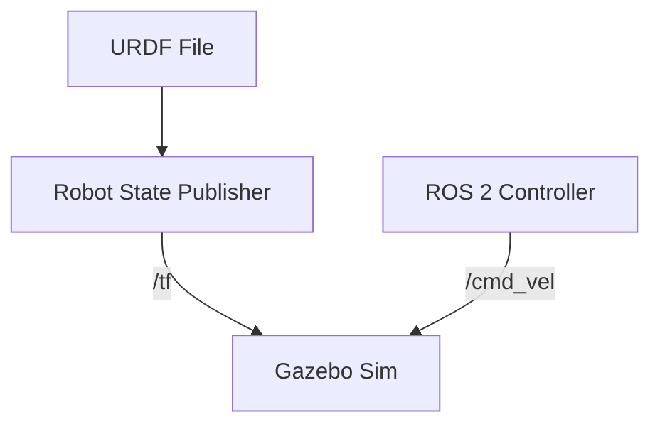

# Digital Twins: Physics & URDF

> "If it doesn't work in sim, it won't work in reality."

## Learning Objectives

By the end of this chapter, you will be able to:
*   Define a robot using **URDF (Unified Robot Description Format)**.
*   Spawn a robot into **Gazebo Classic / Ignition**.
*   Control joints via **ROS 2 Topics**.

## Core Theory: The Universal Description

**URDF** is an XML format representing a robot model. It defines:
1.  **Links**: The physical parts (chassis, wheels).
2.  **Joints**: How parts move (revolute, continuous, fixed).
3.  **Visuals**: How it looks.
4.  **Collisions**: How it interacts physically.

## System Architecture



## Code Example: A Minimal Robot

Create `my_robot.urdf`:

```xml
<?xml version="1.0"?>
<robot name="simple_bot">
  <!-- Base Link -->
  <link name="base_link">
    <visual>
      <geometry>
        <box size="0.5 0.3 0.1"/>
      </geometry>
      <material name="blue">
        <color rgba="0 0 1 1"/>
      </material>
    </visual>
    <collision>
      <geometry>
        <box size="0.5 0.3 0.1"/>
      </geometry>
    </collision>
    <inertial>
      <mass value="5.0"/>
      <inertia ixx="0.1" ixy="0" ixz="0" iyy="0.1" iyz="0" izz="0.1"/>
    </inertial>
  </link>
</robot>
```

### Simulation Workflow: Spawning in Gazebo

To launch this in Gazebo using ROS 2, we use a launch file.

`spawn_robot.launch.py`:

```python
import os
from ament_index_python.packages import get_package_share_directory
from launch import LaunchDescription
from launch.actions import ExecuteProcess
from launch_ros.actions import Node

def generate_launch_description():
    urdf_file = 'my_robot.urdf'
    
    return LaunchDescription([
        # Start Gazebo
        ExecuteProcess(
            cmd=['gazebo', '-s', 'libgazebo_ros_init.so'],
            output='screen'),
            
        # Spawn Entity
        Node(
            package='gazebo_ros',
            executable='spawn_entity.py',
            arguments=['-entity', 'my_bot', '-file', urdf_file],
            output='screen'),
    ])
```

## Deployment Notes

*   **GPU**: Gazebo requires a decent GPU (NVIDIA GTX 1060+ recommended).
*   **Headless**: On cloud servers (EC2/Azure), run `gzserver` only (no GUI) to save resources.
