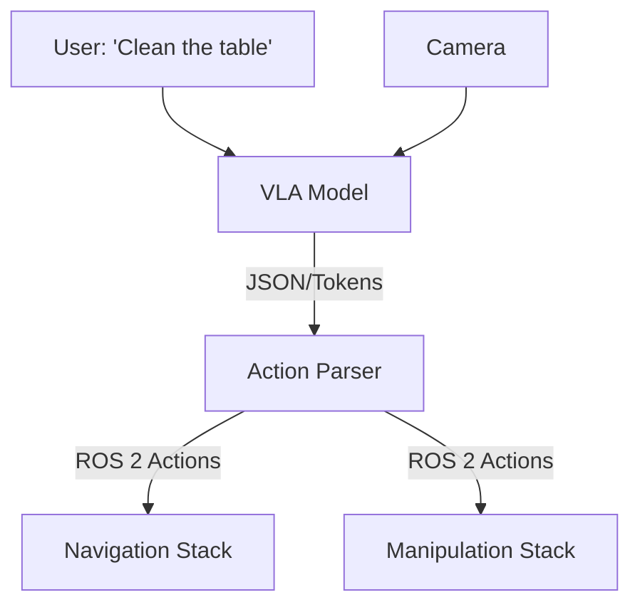

# Vision-Language-Action (VLA)

> "From 'Move to X' to 'Pick up the red apple'."

## Learning Objectives

By the end of this chapter, you will be able to:
*   Understand the **VLA** architecture.
*   Connect a **VLM** (like GPT-4o or RT-2) to ROS 2.
*   Translate **Natural Language** into **Robot Actions**.

## Core Theory: The Semantic Gap

Classic robotics needs precise coordinates (`x=1.2, y=0.5`). Humans speak in concepts (`"Grab the spoon"`).

**VLAs** bridge this gap. They take (Image + Text) and output (Action Tokens).

## System Architecture



## Code Example: The VLA Node

We'll mock a VLM call to control a robot.

`vla_node.py`:

```python
import rclpy
from rclpy.node import Node
from std_msgs.msg import String

class VLANode(Node):
    def __init__(self):
        super().__init__('vla_brain')
        self.cmd_pub = self.create_publisher(String, '/robot/command', 10)
        
        # Simulated "Prompt"
        self.user_prompt = "Pick up the red block"
        self.timer = self.create_timer(5.0, self.run_inference)

    def run_inference(self):
        """Simulates querying a VLA model."""
        self.get_logger().info(f"Thinking about: '{self.user_prompt}'...")
        
        # MOCK INFERENCE (Replace with API call to OpenAI/HuggingFace)
        # Input: Image + "Pick up the red block"
        # Output: specialized action token
        action = "ACTION_GRASP_RED_BLOCK" 
        
        msg = String()
        msg.data = action
        self.cmd_pub.publish(msg)
        self.get_logger().info(f"Decided: {action}")

def main():
    rclpy.init()
    node = VLANode()
    rclpy.spin(node)
    rclpy.shutdown()
```

## Simulation Workflow

1.  Place a **Red Block** and **Blue Block** in Gazebo/Isaac Sim.
2.  Run `vla_node`.
3.  A downstream "Action Server" (which we build next) receives `ACTION_GRASP_RED_BLOCK` and executes the motion planning to the red block's coordinates.

## Deployment Notes

*   **Latency**: VLM inference is slow (1-5 seconds). Do NOT put it in the high-frequency control loop (100Hz).
*   **Edge AI**: Running VLAs locally requires massive VRAM (Jetson Orin 64GB is ideal).
