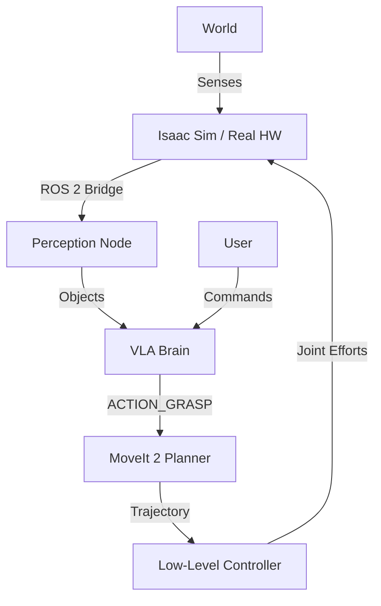

# Capstone: The Autonomous Humanoid

> "Bringing it all together."

## Learning Objectives

By the end of this chapter, you will integrate:
1.  **ROS 2 Nervous System**
2.  **Gazebo/Isaac Simulation**
3.  **VLA Cortex**

...to create a robot that can "See, Plan, and Act".

## System Architecture: The Full Stack



## The "Main Brain" Loop

`main_brain.py`:

```python
import rclpy
from rclpy.node import Node
from rclpy.action import ActionClient
from nav2_msgs.action import NavigateToPose

class HumanoidBrain(Node):
    def __init__(self):
        super().__init__('humanoid_brain')
        self._nav_client = ActionClient(self, NavigateToPose, 'navigate_to_pose')

    def execute_mission(self, target_pose):
        """
        1. Look (Perception)
        2. Think (VLA)
        3. Move (Navigation)
        """
        self.get_logger().info("Mission Started.")
        
        # Step 3: Move (Simplified)
        goal_msg = NavigateToPose.Goal()
        goal_msg.pose = target_pose
        
        self.get_logger().info("Sending Navigation Goal...")
        self._nav_client.wait_for_server()
        self._nav_client.send_goal_async(goal_msg)

def main():
    rclpy.init()
    node = HumanoidBrain()
    # In reality, you'd get target_pose from VLA/Perception
    # node.execute_mission(some_pose)
    rclpy.spin(node)
```

## Simulation Challenge: Pick & Place

**Objective**: The humanoid must walk to a table, identify a marked object, pick it up, and place it in a bin.

1.  **Launch** `humanoid_sim.launch.py` (spawns robot in Isaac Sim).
2.  **Launch** `nav2_bringup` (starts mapping/planning).
3.  **Run** `vla_node` (waits for command).
4.  **Command**: "Throw away the trash."

**Success Criteria**:
*   Robot navigates without collision.
*   Object is detected.
*   Arm executes stable grasp.
*   Object lands in bin.

## Final Words

You have now traversed the entire stack of Physical AI. You started with a Python script and ended with a Vision-Language-Action driven humanoid.

The future of robotics is here, and you have the tools to build it.
