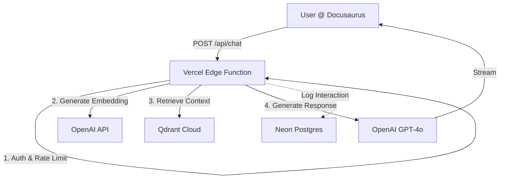

# Feature Specification: Vercel-Native RAG Chatbot

**Feature**: Serverless RAG Chatbot for Physical AI Textbook  
**Version**: 1.0  
**Status**: DRAFT  
**Date**: 2025-12-15  
**Constitution**: [Phase 2 Rules](/constitution.md#phase-2-the-chatbot-vercel-native-rag)

---

## 1. System Architecture

The system is designed as a **stateless, serverless application** running entirely on Vercel's Edge/Serverless infrastructure, integrated into the existing Docusaurus static site.

### 1.1 High-Level Components

| Component | Technology | Responsibility | Hosting |
| :--- | :--- | :--- | :--- |
| **Frontend** | React / Docusaurus | Chat UI, Selection Capture, Markdown Rendering | GitHub Pages (Static) |
| **API Gateway** | Next.js / Vercel Functions | Request routing, Auth, Rate Limiting | Vercel (Edge) |
| **Orchestrator** | OpenAI Agents / ChatKit | Query planning, Context synthesis, Response generation | Vercel (Serverless) |
| **Vector DB** | Qdrant Cloud | Storing & retrieving document embeddings | Qdrant Cloud (Free Tier) |
| **Metadata DB** | Neon (Postgres) | Analytics, Feedback logging, Usage quotas | Neon Serverless (Free Tier) |
| **LLM Provider** | OpenAI API | Embeddings (`text-embedding-3-small`), Chat (`gpt-4o-mini`) | External API |

### 1.2 Architecture Diagram (Textual)



---

## 2. Data Flow

### 2.1 Build-Time Ingestion (Offline)
This process runs during CI/CD or manually by the curriculum architect. It does NOT run at runtime.

1.  **Source**: Scan `docs/**/*.md`.
2.  **Parse**: Extract Frontmatter (Title, ID) and Content.
3.  **Chunk**: Split content by:
    *   Hierarchy (H1 -> H2 -> H3)
    *   Semantic boundaries (paragraphs)
    *   Token limit (approx 512 tokens with 64 token overlap).
4.  **Embed**: Batch request to `text-embedding-3-small`.
5.  **Index**: Upsert vectors to Qdrant collection `textbook_v1`.
    *   *Metadata*: `url`, `chapter_title`, `chunk_text`, `hash`.

### 2.2 Runtime Retrieval & Generation
1.  **Input**: User sends `{ message, mode, selection? }`.
2.  **Embed**: User query is embedded.
3.  **Retrieve**:
    *   **Full-Book Mode**: ANN Search on Qdrant. Top-K (e.g., K=5).
    *   **Selected-Text Mode**: Context is explicitly constructed from `selection` + (optional) limited retrieval around that selection.
4.  **Synthesize**: Construct System Prompt with retrieved context chunks.
5.  **Generate**: Call `chat.completions.create` with `stream: true`.

---

## 3. Retrieval Modes

### 3.1 Mode A: Full-Book RAG
*   **Trigger**: User types in the main chat input without selecting text.
*   **Behavior**: Searches the entire Qdrant index.
*   **Use Case**: "How do I install ROS 2?", "What is VLA?"

### 3.2 Mode B: Selected-Text Isolation
*   **Trigger**: User selects text on the page -> Click "Ask AI".
*   **Behavior**:
    *   **Primary Context**: The exact text selected by the user.
    *   **Secondary Context**: (Optional) 1-2 chunks strictly adjacent to the selection from the same page.
    *   **Constraint**: The LLM is instructed such that *only* the specific text is the strict ground truth.
*   **Use Case**: "Explain this code snippet", "What does 'proprioception' mean in this paragraph?"

---

## 4. API Design (Serverless)

All endpoints reside under `/api` and are deployed as Vercel Route Handlers.

### 4.1 `POST /api/chat`
Streamed chat response.

**Request:**
```json
{
  "messages": [
    {"role": "user", "content": "What are Nodes?"}
  ],
  "context": {
    "pageUrl": "/docs/module-01/ros2-nodes",
    "selection": "Nodes are the fundamental building blocks..." // Optional
  },
  "mode": "full" | "selection"
}
```

**Response:** Server-Sent Events (SSE) stream of text deltas.

### 4.2 `POST /api/retrieve`
Debug endpoint to verify retrieval quality without generation.

**Request:**
```json
{
  "query": "ROS 2 Humble setup"
}
```

**Response:**
```json
{
  "chunks": [
    { "text": "...", "score": 0.89, "source": "..." }
  ]
}
```

---

## 5. Constraints & Non-Goals

### 5.1 Constraints
1.  **Cold Start**: Code must minimize import weight. Use lightweight SDKs or raw `fetch`.
2.  **Execution Time**: Vercel Free Tier limits functions to 10s (Serverless) or 30s (Edge). Streaming is mandatory to keep connections alive.
3.  **Statelessness**: No conversation history is stored on the server. The client must send the relevant previous turn (if implementing multi-turn).

### 5.2 Non-Goals
*   **No Websockets**: Too complex for serverless/free tier.
*   **No Python Runtime**: The backend is TypeScript/Node.js to align with the frontend stack.
*   **No User Accounts**: Open access (rate-limited by IP/Fingerprint).
*   **No "Agents" with Tools**: The "Agent" is purely a retrieval, reasoning, and synthesis engine. It does not call external tools (calculator, web browser).

---

## 6. Security

*   **Environment Variables**: Usage of `process.env.OPENAI_API_KEY`, etc.
*   **CORS Policy**: Access-Control-Allow-Origin set strictly to the production domain (and `localhost:3000` for dev).
*   **Rate Limiting**: Implementation of Upstash Redis (Free Tier) or in-memory fallback for basic flood protection.
